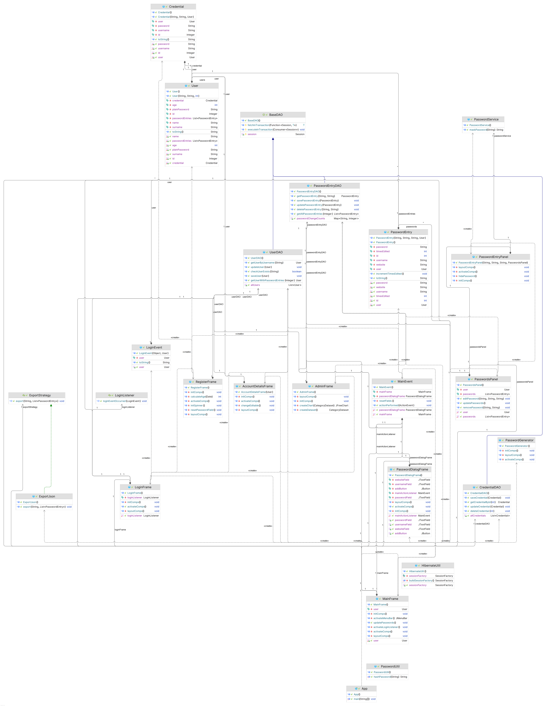

# Password Manager

Password Manager is a Java Swing application designed to provide users with a
secure and convenient way to store, generate, and manage passwords.
It features a user-friendly graphical interface, an intuitive design, 
and adheres to the **MVC (Model-View-Controller)** architecture for improved maintainability
and scalability.

**Disclaimer:** *This project is a student's work created for the Object-Oriented Programming subject.*

---

## Features

- **User Management**: Allows users to register, log in, and manage their accounts.
- **Password Management**: Store, view, edit, and generate strong passwords.
- **Data Export**: Export stored data in JSON format for backups.
- **Admin Dashboard**: Monitor password change activities across all users via graphical reports.
- **Security and Efficiency**: Implements design patterns like Strategy and adheres to principles like Single Responsibility and Open/Closed for extensibility.

---

## Application Modules

1. **Login Frame**: The initial screen for user authentication and registration.
2. **Register Frame**: A simple form for creating user accounts.
3. **Main Frame**: Central hub for managing passwords and account data.
4. **Navigation**: Intuitive menu bar for accessing app features (File, Account, Help).
5. **Admin Panel**: Exclusive for administrators to visualize user password changes.

---

## Database

- **Backend**: MySQL database hosted on DigitalOcean.
- **Frameworks**: Hibernate (ORM) and Jakarta Persistence (API).
- **Storage**: Relational database design with 3 interconnected tables for efficient data handling.

---

## Technologies and Libraries

- **MigLayout**: Simplifies UI component layout.
- **FlatLaf**: Provides a modern look-and-feel for the app.
- **Gson**: Handles JSON data manipulation.
- **Hibernate**: Facilitates database interaction.
- **Jakarta Persistence**: Maps Java objects to database entries.
- **MySQL Connector**: Connects the application to the MySQL database.
- **JFreeChart**: Generates graphical reports in the Admin Panel.

---

## Installation and Setup

1. **Clone the repository**:
   ```bash
   git clone https://github.com/your-username/password-manager.git
   ```
2. **Navigate to the project directory**:
   ```bash
   cd password-manager
   ```
3. **Build the project using Maven**:
   ```bash
   mvn clean install
   ```
4. **Configure the database**:
    - Set up a MySQL database.
    - Update the `hibernate.cfg.xml` file with your database details.
5. **Run the application**:
   ```bash
   java -jar target/password-manager.jar
   ```

---

## How It Works

1. **Login/Registration**:
    - Users can register and log in to access their accounts.
2. **Password Management**:
    - Add, edit, and generate secure passwords.
    - Export passwords as JSON files for backups.
3. **Admin Monitoring**:
    - Admins can view graphical statistics of password changes across users.
4. **Secure Storage**:
    - Passwords are stored securely in a relational database.

---

## UML Diagram

The project's structure and data flow are organized as shown below:


